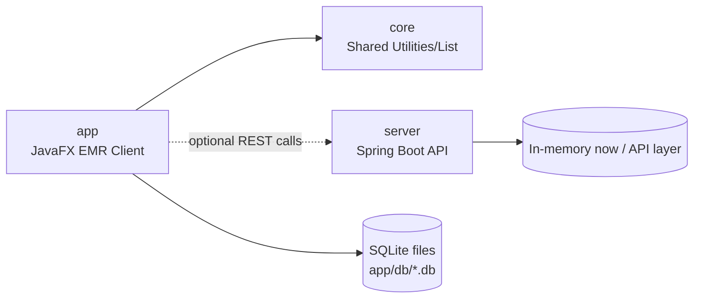

# Architecture

This repository is a Gradle multi-module project with three active subprojects.

## Module Structure

- `app` (JavaFX desktop EMR)
  - Main UI application and clinical features
  - Entry point: `com.emr.gds.IttiaApp`
- `server` (Spring Boot API)
  - REST controllers and API/domain services
  - Entry point: `com.emr.gds.server.GdsEmrServerApplication`
- `core` (shared library)
  - Shared utility/data-structure code used by app-level features

## Subproject Notes (`utilities`, `list`, `build-logic`, etc.)

- In this codebase, `utilities` and `list` are packaged under the `core` module:
  - `core/src/main/java/org/example/utilities`
  - `core/src/main/java/org/example/list`
- A separate `build-logic` module is not currently included in `settings.gradle.kts`.
  - Build conventions are defined in root/module `build.gradle.kts` files.

## Where Code Lives

### `app` module
- UI screens and feature UI:
  - `app/src/main/resources/fxml`
  - `app/src/main/resources/com/emr/gds/features/**`
- Controllers:
  - `app/src/main/java/com/emr/gds/features/**/controller`
  - `app/src/main/java/com/emr/gds/soap/presenter`
  - `app/src/main/java/com/emr/gds/features/template/TemplateEditController.java`
- Services (application/use-case):
  - `app/src/main/java/com/emr/gds/service`
  - `app/src/main/java/com/emr/gds/features/**/service`
  - `app/src/main/java/com/emr/gds/features/history/application`
- Repositories/persistence:
  - `app/src/main/java/com/emr/gds/repository`
  - `app/src/main/java/com/emr/gds/repository/sqlite`
  - feature-specific DB access: `app/src/main/java/com/emr/gds/features/**/db`

### `server` module
- Controllers (REST endpoints):
  - `server/src/main/java/com/emr/gds/server/controller`
- Services:
  - `server/src/main/java/com/emr/gds/server/service`
- Repositories:
  - `server/src/main/java/com/emr/gds/server/repository`
- DTO/API model:
  - `server/src/main/java/com/emr/gds/server/dto`
  - `server/src/main/java/com/emr/gds/server/api`
  - `server/src/main/java/com/emr/gds/server/model`

### `core` module
- Utility classes:
  - `core/src/main/java/org/example/utilities`
- Data-structure/list classes:
  - `core/src/main/java/org/example/list`

## Simple Diagram

## Runtime Data Boundaries

- `app` owns local SQLite-backed workflows (templates, abbreviations, history, references, medication, etc.).
- `server` provides API endpoints and can be run independently (`./gradlew runServer`).
- `core` is dependency-only and has no standalone runtime.
